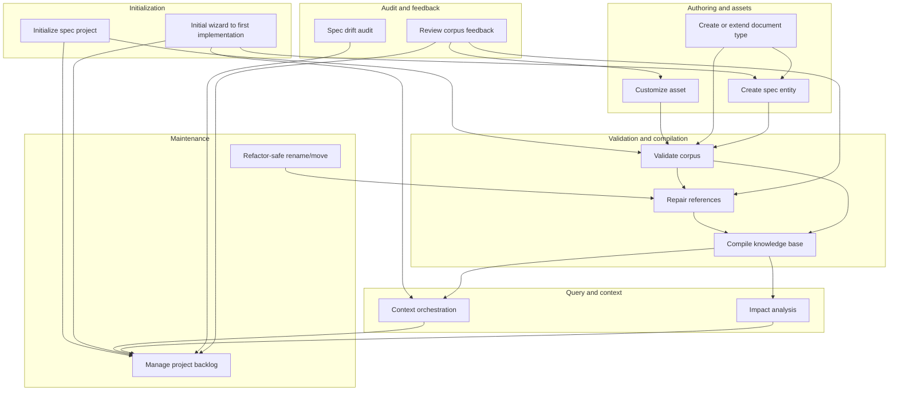
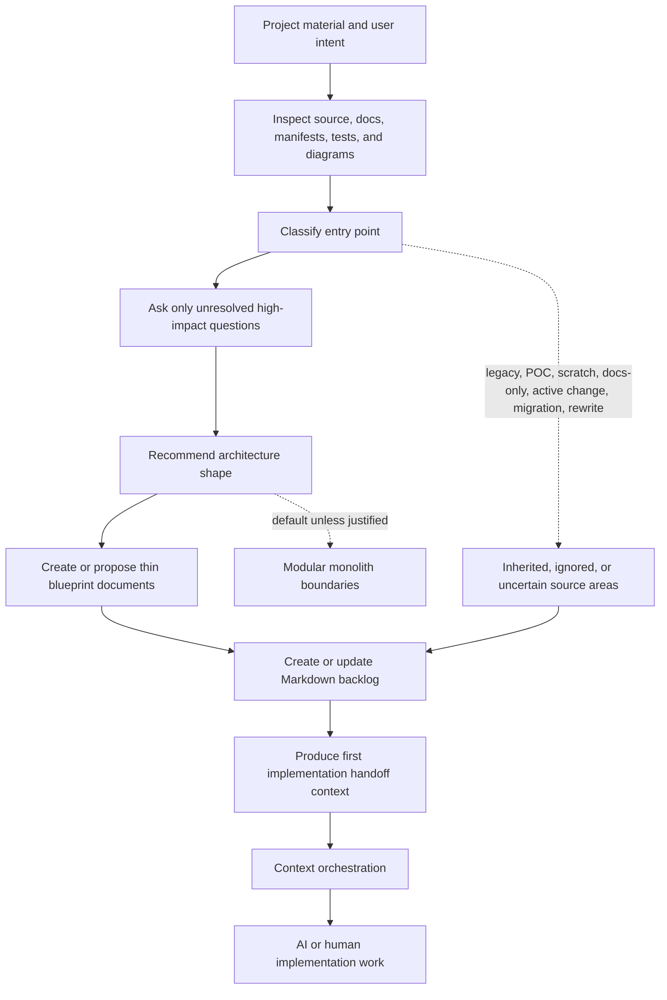
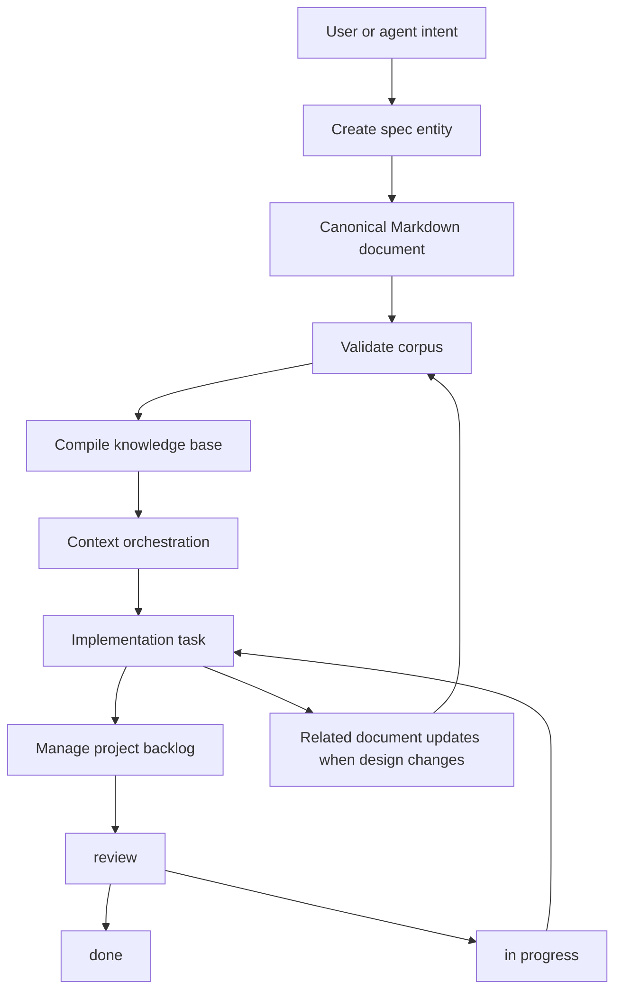
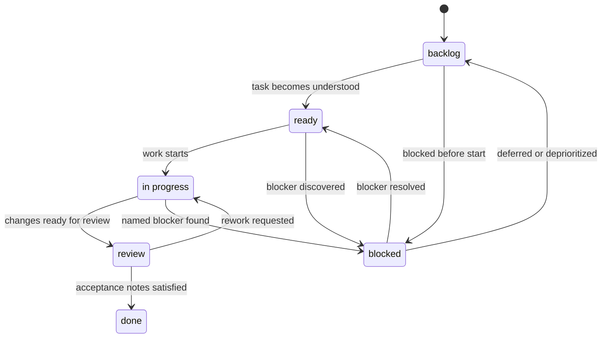
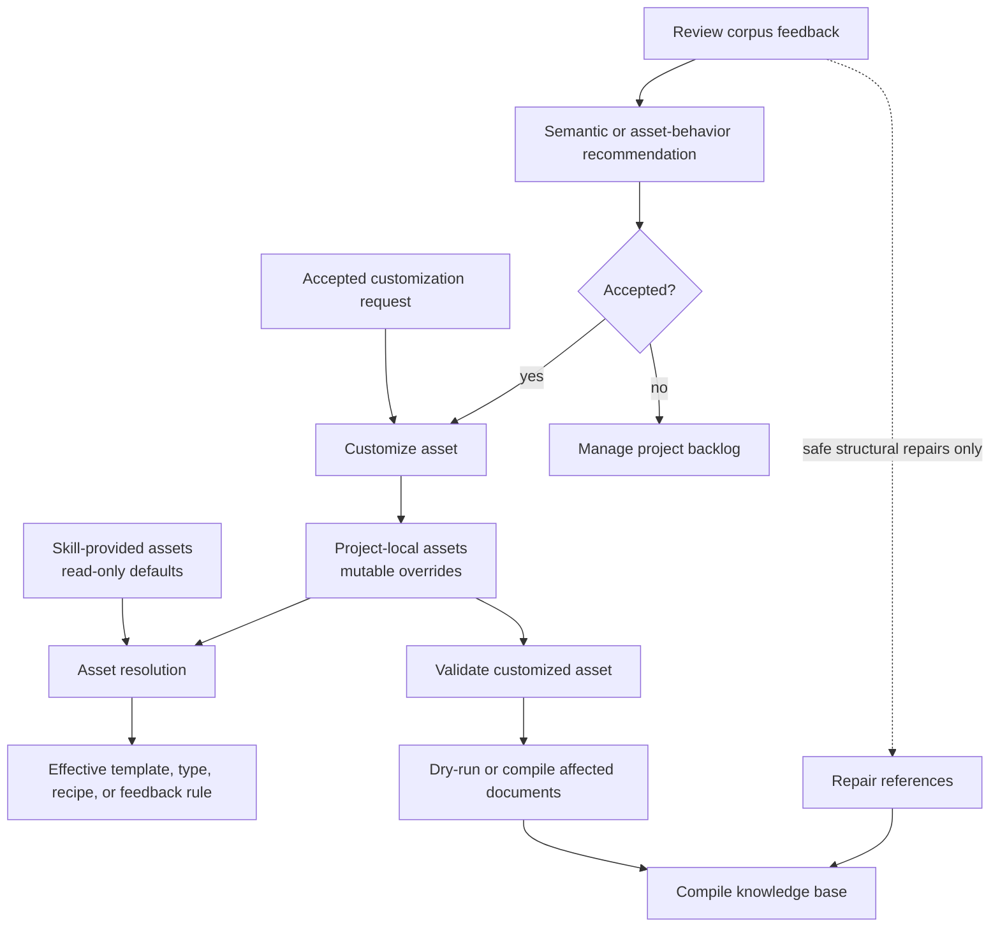
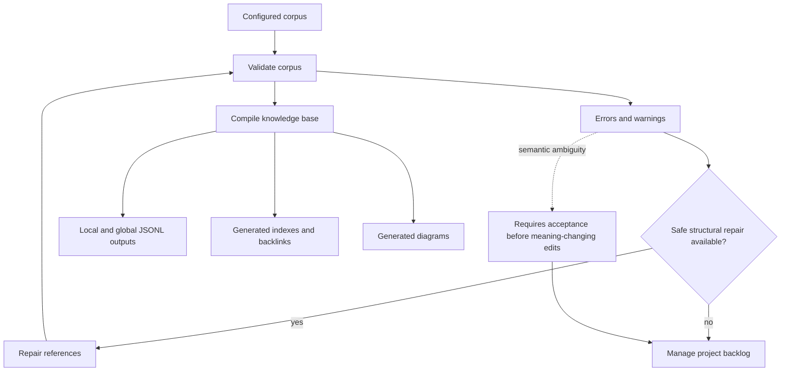
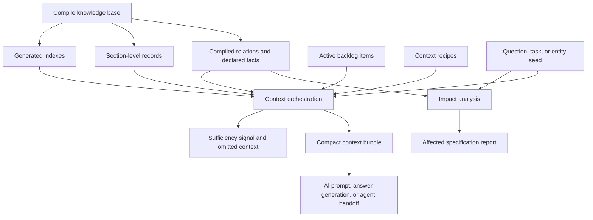
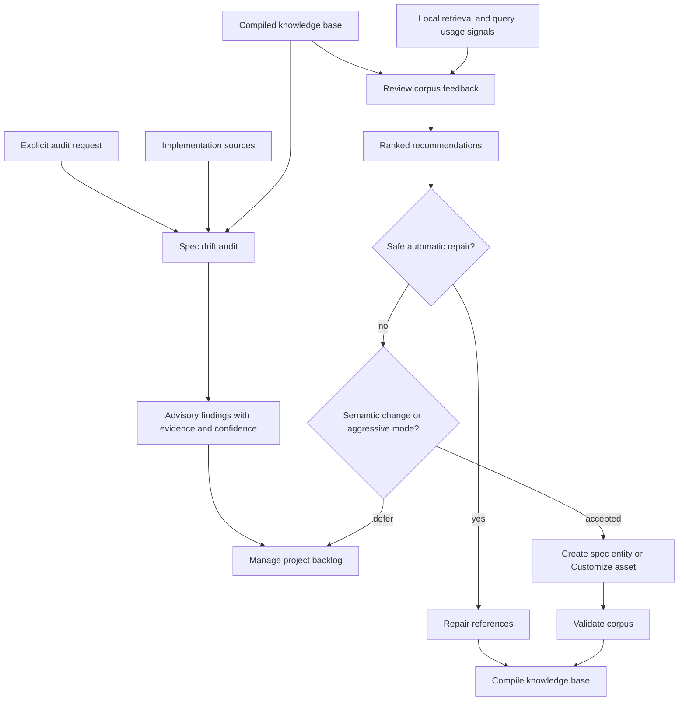
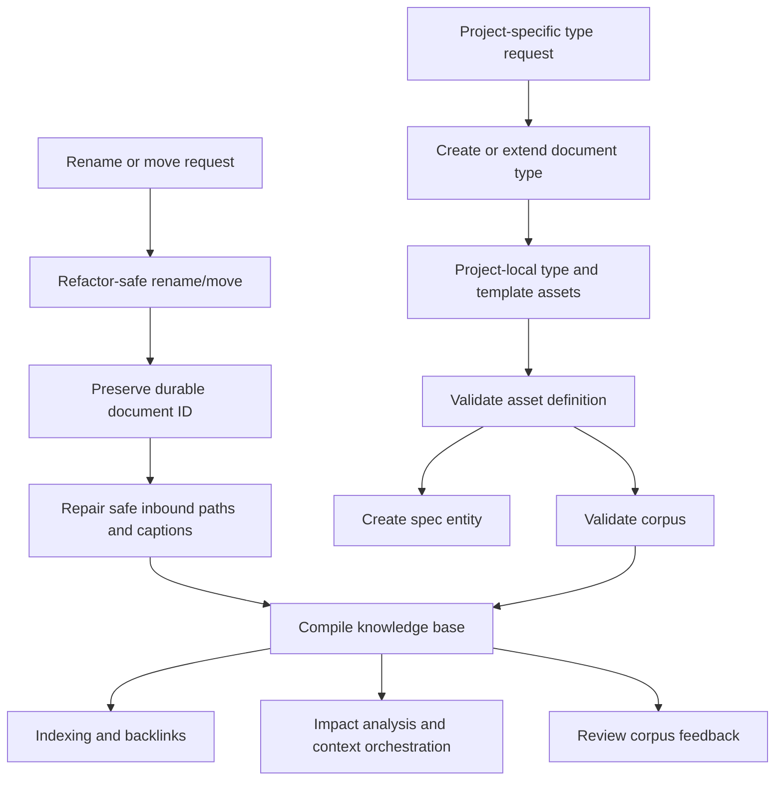

# Spec Compiler Skills — Product Requirements

## 1. Purpose

The spec compiler is delivered through user-facing skills, not as a bare parser alone. These skills let humans and AI agents initialize, create, maintain, query, orchestrate context from, audit, and improve a specification corpus while keeping deterministic compiler behavior separate from higher-cost AI assistance.

This document defines the v1 workflow-level skill surface. It intentionally does not lock final command names or CLI syntax.

The initial wizard, Markdown backlog, and first implementation experience are defined in [Initial Workflow, Backlog, and First Implementation Experience — Product Requirements](./INITIAL_WORKFLOW_EXPERIENCE_REQUIREMENTS.md).

## 2. Product Principles

1. **Scripts first for deterministic work**  
   Validation, repair, compilation, graph traversal, and artifact generation should use deterministic scripts wherever possible.

2. **AI where judgment is required**  
   AI should assist with intent interpretation, missing-content elicitation, concise authoring, and implementation/spec drift review.

3. **Canonical documents stay central**  
   Skills may begin from generated indexes or user intent, but persisted truth remains in detailed Markdown documents.

4. **Safe mutation, explicit semantics**  
   Skills may automatically apply safe structural repairs. Meaning-changing edits require user or calling-agent acceptance.

5. **Smallest useful context**  
   Skill outputs intended for AI consumption should prefer compact slices and focused bundles over whole-corpus loading.

6. **Skill assets are immutable defaults**  
   Built-in templates, type definitions, retrieval recipes, and feedback rules shipped with the skill are read-only. Project-specific changes must target project-local assets.

7. **Feedback is conservative by default**  
   Feedback workflows may apply safe structural repairs where policy allows, but document restructures, semantic links, and asset-behavior changes require acceptance unless an explicit aggressive mode is requested.

8. **Progress is explicit**  
   Incomplete documentation, deferred implementation work, unresolved decisions, and findings that are not fixed immediately should be visible in the project backlog.

## 3. Skill Action Model

Each skill action must define:

- user intent it serves,
- expected inputs,
- expected outputs,
- whether execution is script-driven, AI-assisted, or hybrid,
- whether it may edit canonical documents,
- whether user confirmation is required before changes are applied.

## 4. Required v1 Skills

### 4.1 Initialize spec project

**Purpose**  
Create the project-local configuration and asset locations needed for a spec corpus while using skill-provided assets as immutable defaults.

**Workflow**

1. create or update the project-local compiler configuration,
2. configure document sets, shared folders, and generated-output paths,
3. create project-local asset folders for templates, document type definitions, retrieval recipes, and feedback rules,
4. create or locate the project-local Markdown backlog,
5. reference skill-provided default assets without eagerly copying every built-in asset,
6. validate that the initialized configuration can resolve both skill and project-local asset layers.

**Execution style**  
Script-driven with optional AI assistance for choosing document set boundaries.

**Mutation policy**  
May create or update project-local configuration and empty or minimal project-local asset folders. Must not modify installed skill assets.

### 4.2 Customize asset

**Purpose**  
Create or update a project-local template, type definition, retrieval recipe, or feedback rule without mutating the skill-provided baseline asset.

**Workflow**

1. resolve the requested asset from the project-local layer or skill asset bundle,
2. materialize a project-local editable copy only when customization is requested and no local override exists,
3. apply the requested or accepted changes to the project-local asset,
4. validate the customized asset,
5. compile or dry-run affected documents where practical.

**Execution style**  
Hybrid: deterministic asset resolution and validation, AI-assisted editing where judgment is required.

**Mutation policy**  
May modify project-local assets. Must not modify installed skill assets.

### 4.3 Create spec entity

**Purpose**  
Create a new canonical specification document for a UI screen, UI flow, API, data model, component, requirement, rule, or another supported document type.

**Workflow**

1. infer or ask for the intended document type,
2. load the matching template from the configured asset folders,
3. ask only for missing required information,
4. create the canonical Markdown document,
5. validate the new document,
6. compile affected indexes and derived artifacts.

**Execution style**  
Hybrid: AI-assisted intent handling and drafting, deterministic template loading and compilation.

**Mutation policy**  
May create canonical documents after the required inputs are known.

### 4.4 Validate corpus

**Purpose**  
Check whether the corpus is structurally sound and internally consistent.

**Workflow**

- parse configured document sets and shared folders,
- validate metadata, IDs, Markdown links, declared facts, relation rules, and generated-output freshness,
- separate errors from warnings,
- return machine-readable and human-readable findings.

**Execution style**  
Script-driven.

**Mutation policy**  
Read-only unless paired with a separate repair action.

### 4.5 Repair references

**Purpose**  
Keep the corpus navigable as documents evolve.

**Workflow**

- repair safe broken-path references where the target identity is known,
- convert resolvable bare IDs into Markdown links where required,
- refresh stale link captions from current target titles,
- report unresolved or semantic ambiguities instead of guessing.

**Execution style**  
Script-driven.

**Mutation policy**  
May automatically apply safe structural repairs; semantic changes require approval.

### 4.6 Compile knowledge base

**Purpose**  
Build machine-readable outputs and generated views from canonical documents.

**Workflow**

- generate local JSONL outputs per configured document set,
- generate a merged global JSONL output set,
- generate backlinks, section-level search records, indexes, and diagrams,
- preserve document-set membership for cross-set querying.

**Execution style**  
Script-driven.

**Mutation policy**  
May update generated artifacts, not canonical meaning.

### 4.7 Impact analysis

**Purpose**  
Answer questions such as “what is affected if this API, component, table, screen, or rule changes?”

**Workflow**

- resolve the starting entity,
- traverse compiled relations and declared facts,
- group affected documents by relation type and distance,
- return a concise explanation plus machine-readable affected IDs.

**Execution style**  
Script-driven.

**Mutation policy**  
Read-only.

### 4.8 Context orchestration

**Purpose**  
Produce the smallest sufficient spec context for an AI task or question through token-aware staged retrieval and graph expansion.

**Workflow**

- accept a task description or starting entity,
- search section-level records and graph relations,
- estimate or accept a context budget,
- start with the smallest high-confidence slices,
- expand through typed relations according to task-specific context recipes where available,
- select the minimum useful slices with IDs, titles, facts, nearby relations, and estimated token costs,
- report omitted but potentially useful context when budget prevents inclusion,
- identify whether the selected context appears sufficient to answer the task,
- optionally use AI ranking when deterministic retrieval yields several plausible bundles,
- emit a compact bundle suitable for prompt injection, answer generation, or agent handoff.

**Execution style**  
Script-first with optional AI ranking.

**Mutation policy**  
Read-only.

### 4.9 Spec drift audit

**Purpose**  
Detect likely divergence between authored specifications and the current implementation.

**Workflow**

- accept an explicit audit request and configured implementation sources,
- compare API specs, DFD/data-flow specs, and component-responsibility specs against code,
- report likely mismatches with evidence, confidence, and affected documents,
- keep advisory findings separate from deterministic validation output.

**Execution style**  
AI-heavy.

**Mutation policy**  
Read-only by default; follow-up edits require explicit acceptance.

### 4.10 Refactor-safe rename/move

**Purpose**  
Rename or move specification documents without breaking identity or navigation.

**Workflow**

- preserve the durable document ID,
- move or rename the canonical document,
- repair safe inbound paths,
- refresh stale captions,
- recompile affected indexes and artifacts.

**Execution style**  
Script-driven.

**Mutation policy**  
May modify canonical file paths and safe references automatically.

### 4.11 Create or extend document type

**Purpose**  
Let teams add project-specific spec kinds using the same declarative framework as built-in types.

**Workflow**

- gather the desired family, metadata, sections, facts, relations, and template needs,
- create or update the project-local type-definition asset and matching template asset,
- validate the asset definition,
- make the new type available to document creation, validation, indexing, querying, context orchestration, and feedback workflows.

**Execution style**  
Hybrid.

**Mutation policy**  
May create or update project-local type assets after intent is known. Must not modify installed skill-provided type assets.

### 4.12 Review corpus feedback

**Purpose**  
Improve the corpus as an AI-consumable context system by identifying weak document structure, missing links, inefficient retrieval paths, and useful project-local asset improvements.

**Workflow**

- compile the current corpus,
- inspect static diagnostics such as oversized sections, weak links, orphan documents, high-hop paths, and duplicate reusable details,
- inspect local retrieval/query usage signals where available, including selected slices, expansion paths, context cost, answer sufficiency, and repeated co-retrieval,
- produce ranked recommendations with evidence and expected context-efficiency or answerability benefit,
- classify each recommendation as safe automatic repair, proposed semantic change, or explicit aggressive-mode candidate,
- apply safe repairs where policy allows,
- propose semantic document edits or project-local asset changes for acceptance by default.

**Execution style**  
Script-first with optional AI assistance for ranking, explanation, and proposed semantic edits.

**Mutation policy**  
May apply safe structural repairs and update generated reports. May modify canonical documents or project-local assets only when the change is safe by policy or explicitly accepted. Must not modify installed skill assets.

### 4.13 Initial wizard to first implementation

**Purpose**  
Move from uncertain project material to the first standalone runnable implementation unit with only the necessary blueprint documentation and backlog-managed follow-up work.

**Workflow**

1. inspect available project material, including source code, existing documents, package manifests, tests, diagrams, and user-provided intent,
2. classify the entry point as legacy source, incomplete POC, scratch idea, inspired project, docs-only project, active-codebase change, migration, or rewrite,
3. ask only unresolved questions that affect project partitioning, first-slice selection, source inheritance, local execution, or blockers,
4. recommend an initial architecture shape, defaulting to modular monolith unless microservice boundaries are justified,
5. create or propose thin blueprint documents for the project overview, architecture partitioning, and first implementation slice,
6. create or update the Markdown backlog with deferred documentation, implementation, decision, validation, audit, and cleanup tasks,
7. produce first implementation handoff context with selected slices, relevant source paths, run/test expectations, active backlog items, and unresolved decisions.

**Execution style**  
Hybrid: deterministic project inspection and asset resolution, AI-assisted classification, blueprint drafting, and slice selection.

**Mutation policy**  
May create project-local blueprint documents and backlog items after the required intent is known. Must not modify source implementation files as part of the wizard.

### 4.14 Manage project backlog

**Purpose**  
Let humans and AI agents track incremental documentation and implementation progress in a project-local Markdown backlog.

**Workflow**

- create or locate the configured Markdown backlog,
- list active tasks by state, type, owner, document, component, document set, or source area,
- create tasks from user intent, WIP document gaps, validation findings, drift audit findings, corpus feedback, or implementation discoveries,
- move tasks through `backlog`, `ready`, `in progress`, `blocked`, `review`, and `done`,
- link tasks to canonical documents, generated findings, source paths, implementation slices, and unresolved decisions,
- summarize progress and blockers for human or agent review.

**Execution style**  
Script-first with optional AI assistance for summarizing progress, converting findings into tasks, and preserving user-authored context.

**Mutation policy**  
May modify the project-local Markdown backlog. May modify canonical documents only when paired with an explicit authoring, repair, feedback, or accepted follow-up edit workflow.

## 5. Workflow Diagrams

These diagrams are requirement-level workflow descriptions. They describe skill transitions, acceptance gates, and artifact flow without defining final command names or CLI syntax.

### 5.1 Overall skill map

### 5.2 Initial wizard to first implementation

### 5.3 Document and implementation workflow

### 5.4 Backlog management state machine

### 5.5 Document template and asset improvement

### 5.6 Validation, repair, and compile loop

### 5.7 Query and context workflow

### 5.8 Audit and feedback workflow

### 5.9 Refactor and type extension workflow

## 6. Skill Contract Summary

| Skill | Inputs | Outputs | Style | Canonical edits | Confirmation |
| --- | --- | --- | --- | --- | --- |
| Initialize spec project | project intent, corpus roots | config, local asset folders, backlog, validation result | Script-first | No | Only for unresolved corpus boundaries |
| Customize asset | asset identity, desired change | project-local asset, validation result | Hybrid | No | Yes for semantic asset behavior |
| Create spec entity | entity intent, required facts | canonical document, validation result | Hybrid | Yes | Only for unresolved semantic choices |
| Validate corpus | configured corpus | findings | Script | No | No |
| Repair references | configured corpus | repaired references, unresolved report | Script | Safe edits only | No for safe repairs |
| Compile knowledge base | configured corpus | JSONL, indexes, backlinks, diagrams | Script | No | No |
| Impact analysis | entity or change seed | affected-spec report | Script | No | No |
| Context orchestration | task, question, or entity seed | compact context bundle, sufficiency signal | Script-first | No | No |
| Spec drift audit | audit target, implementation sources | advisory findings | AI-heavy | No by default | Yes for follow-up edits |
| Refactor-safe rename/move | document, target path/name | moved doc, repaired refs | Script | Yes | No for requested move |
| Create or extend document type | desired type behavior | project-local type asset, template asset | Hybrid | Project-local assets only | Yes for unresolved semantic choices |
| Review corpus feedback | corpus, optional usage signals | feedback report, machine-readable findings, optional safe repairs | Script-first | Safe edits only by default | Yes for semantic changes or aggressive mode |
| Initial wizard to first implementation | project material, user intent | blueprints, backlog, architecture recommendation, first-slice handoff | Hybrid | Blueprint docs only | Only for unresolved high-impact choices |
| Manage project backlog | backlog action, optional findings or task links | updated Markdown backlog, progress summary | Script-first | No by default | Only when paired with semantic document edits |

## 7. Acceptance Scenarios

### 7.1 Project initialization

Given a new project, when the initialize skill runs, then it must create the project-local configuration, project-local asset folder structure, and Markdown backlog, configure corpus boundaries and generated-output paths, and reference skill-provided assets without copying every built-in asset.

### 7.2 Asset customization

Given a request to customize a built-in API template, when the customize-asset skill runs, then it must materialize or update a project-local template override, validate it, and leave the installed skill template unchanged.

### 7.3 Template-based entity creation

Given a user request to add a new UI screen, when the skill resolves the matching type, then it must load the configured template, ask only for missing required inputs, create the canonical document, validate it, and compile affected artifacts.

### 7.4 Reference repair

Given a prose occurrence of a resolvable document ID, when the repair skill runs, then it must replace the occurrence with an ordinary Markdown link using the current target title as its caption.

### 7.5 Caption refresh

Given an existing Markdown link to a document whose title changed, when the repair skill runs, then it must update the visible caption while preserving the same target identity.

### 7.6 Multi-set compilation

Given multiple services and a shared-information folder, when the compile skill runs, then it must emit local JSONL outputs for each set and a merged global artifact set for the whole system.

### 7.7 Impact analysis

Given a selected API document, when impact analysis runs, then it must return directly and indirectly affected specifications grouped by relation type.

### 7.8 Context orchestration

Given an AI coding task involving one feature, when context orchestration runs, then it must return compact relevant slices and active related backlog items rather than unrelated full documents, include estimated context cost, and identify whether the selected context is sufficient.

### 7.9 Drift audit

Given an explicit request to audit an API spec against code, when the audit runs, then it must return likely mismatches with evidence and confidence without mutating the source documents, and it may create or propose backlog tasks for findings that are not fixed immediately.

### 7.10 Refactor-safe rename

Given a document move that preserves the stable ID, when the rename/move skill runs, then it must update safe inbound references and compiled artifacts without changing document identity.

### 7.11 Custom document type

Given a request to add a project-specific document type, when the create-or-extend-type skill runs, then it must create valid project-local assets that participate in creation, validation, indexing, backlinks, graph queries, context orchestration, and feedback according to the declared behavior.

### 7.12 Feedback report

Given a corpus with oversized sections, weak links, and local retrieval usage signals, when the feedback skill runs, then it must produce a ranked human-readable report and machine-readable findings with affected paths, recommendation types, evidence, expected benefit, action classification, and stable recommendation IDs.

### 7.13 Feedback safe repair

Given stale link captions or resolvable bare IDs, when feedback runs under the default policy, then it may apply safe structural repairs and must report what changed.

### 7.14 Feedback semantic recommendation

Given a proposed document split, new semantic link, template change, or type retrieval-hint change, when feedback runs under the default policy, then it must propose the change for acceptance rather than silently applying it.

### 7.15 Feedback local asset target

Given feedback that recommends improving a built-in template, type definition, retrieval recipe, or feedback rule, when the recommendation is accepted, then the workflow must write the change to a project-local asset override and must not modify the installed skill asset.

### 7.16 Explicit aggressive feedback

Given the user explicitly enables aggressive mode, when feedback identifies high-confidence restructuring opportunities, then it may prepare or apply those actions according to policy while clearly reporting the non-default mode, evidence, and affected files.

### 7.17 Initial wizard

Given uncertain project material, when the initial wizard runs, then it must classify the entry point, recommend an architecture shape, create or propose thin blueprint documents, create or update the Markdown backlog, and return first implementation handoff context without requiring a complete specification corpus.

### 7.18 Modular-first architecture recommendation

Given weak justification for independent services, when the initial wizard recommends an architecture, then it must default to modular monolith boundaries while preserving enough separation for later service extraction.

### 7.19 Backlog-managed WIP documents

Given a blueprint document with missing sections or unresolved decisions, when backlog management runs, then it must create or update linked backlog tasks rather than treating the document as complete.

### 7.20 Agent progress update

Given an agent completes an implementation task, when backlog management updates progress, then it must preserve related user-authored context, link affected documents or source paths, and move the task to `review` or `done` only when the acceptance notes are satisfied.

## 8. Assumptions and Defaults

1. v1 includes all fourteen skills defined in this document.
2. Final command names and exact CLI syntax are deferred.
3. Skills may be invoked by humans or AI agents.
4. Deterministic script workflows are preferred whenever they can fully satisfy the task.
5. AI audits are explicit on-demand actions because they may consume substantial tokens.
6. Generated artifacts may be rewritten automatically; canonical semantic edits require acceptance when meaning is uncertain.
7. Project backlog state is Markdown-first in v1.
8. Skill-provided assets are immutable defaults.
9. Project-local assets are the mutable layer for customization and feedback-driven improvement.
10. Initialization should not eagerly copy all built-in assets into the project.
11. Feedback is conservative by default: safe repairs may be automatic, while semantic restructuring and asset-behavior changes require acceptance unless aggressive mode is explicitly enabled.
