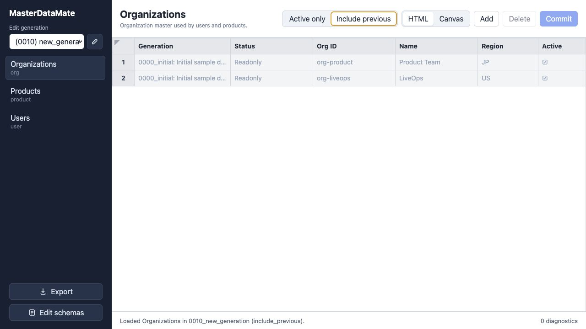
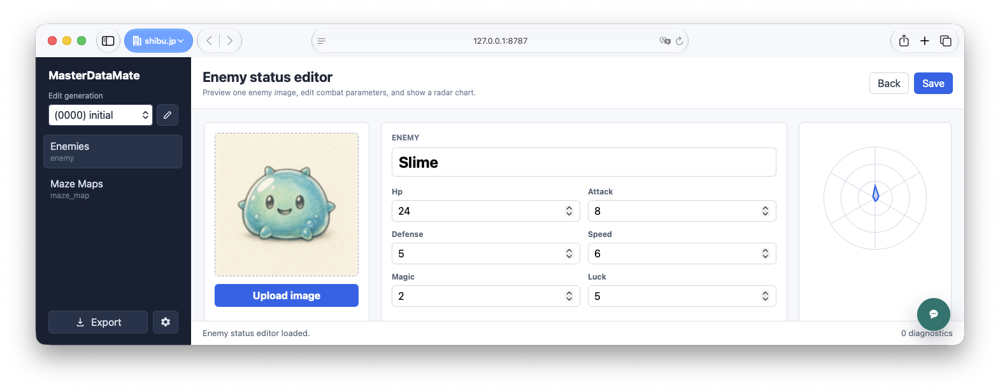
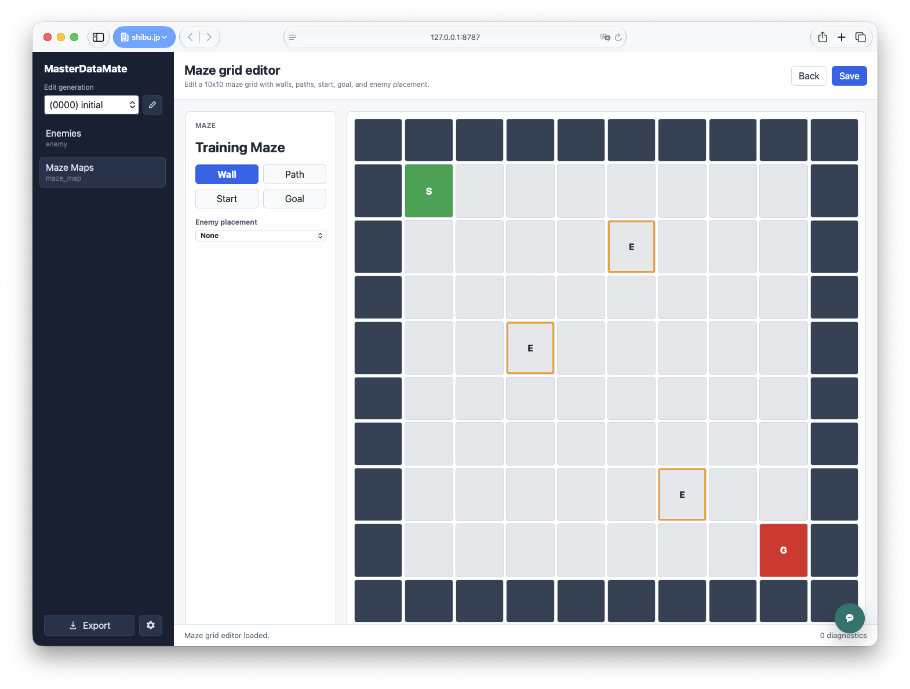
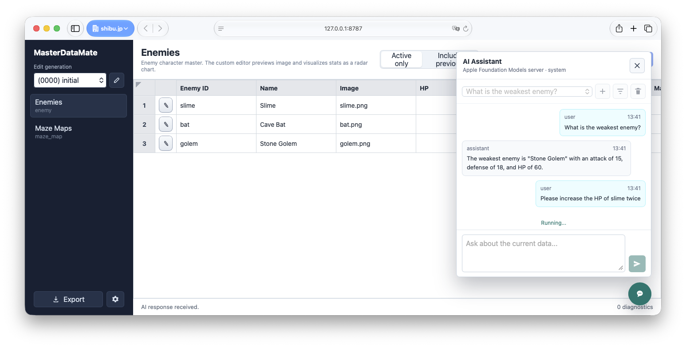

# MasterDataMate

[English README](./README.md)

MasterDataMate は、Git で管理する表形式のマスタデータ向けの
スキーマ駆動エディタです。正本データを YAML として保存し、
テーブルごとのスキーマに基づいてレコードを検証し、世代ごとの
データレイヤーを扱い、マージ済みデータをバックエンド向けの形式へ
エクスポートできます。

## 機能

- React/Vite フロントエンドでマスタデータを編集できます。
- スキーマとレコードをレビューしやすい YAML ファイルとして保持します。
- プロジェクトローカルの `masterdata/` ワークスペースを読み書きします。
- 画像付きの敵ステータス調整やグリッド形式のマップ編集など、ドメイン固有の作業向けにプロジェクトローカルのカスタムエディタを開けます。
- 編集中のデータについて、画面内の AI アシスタントに質問しながら確認や編集を進められます。
- フロントエンドを同梱した単一の Go Web サーバーバイナリをビルドできます。
- Go のサービス層を共有する Wails デスクトップホストをビルドできます。
- ローカルビルド済み、または事前ビルド済みネイティブバイナリを npm ラッパーから起動できます。

## スクリーンショット

### テーブル編集



### カスタムエディタ

カスタムエディタは、同じスキーマ管理されたマスタデータの上に、
用途に合わせた編集画面を提供できます。たとえば、画像アップロードと
ステータス可視化を備えた敵ステータスエディタや、壁、通路、開始地点、
ゴール、敵配置を塗り分ける迷路エディタを利用できます。





### AI アシスタント

AI アシスタントパネルは編集ワークスペースから利用でき、表示中のデータについて
質問したり、レコードを比較したり、テーブル表示を文脈に保ったまま変更を依頼できます。



## 必要なもの

- Node.js と npm
- Go
- Wails ツールチェーン。デスクトップ配布物をビルドする場合のみ必要です。

## インストール

JavaScript 依存関係をインストールします。

```bash
npm ci
```

## 開発

Vite 開発サーバーを起動します。

```bash
npm run dev
```

Node/Hono 開発サーバーを起動します。

```bash
npm start
```

ワークスペースを指定して Go Web サーバーを起動します。

```bash
npm run start:go -- --workspace .
```

サンプルワークスペースは `masterdata/` にあります。

## ビルド

フロントエンドをビルドします。

```bash
npm run build
```

React フロントエンドをビルドし、Go サーバーバイナリに同梱します。

```bash
npm run build:go
./dist-native/masterdatamate --workspace .
```

Go サーバーは `go:embed` で `dist` を埋め込み、`/api/*`、
Vite の静的アセット、SPA ルート用の `index.html` フォールバックを提供します。

## npm ラッパー

`npm run build:go` 実行後のローカル開発では、次のように起動できます。

```bash
npx masterdatamate --workspace .
```

公開パッケージでは、プラットフォーム別バイナリを
`prebuilds/<platform>-<arch>/masterdatamate` に配置できます。

## デスクトップビルド

Wails デスクトップエントリポイントをビルドします。

```bash
npm run build:desktop
```

macOS では `.app` バンドルを作成できます。

```bash
npm run package:desktop:mac
```

`wails.json` は Wails パッケージング用のフロントエンドビルドフックを定義します。
デスクトップホストは Web サーバー版と同じ Go ホスト層と Vite フロントエンドバンドルを再利用します。

## Make ターゲット

リポジトリには `Makefile` も含まれています。

```bash
make install
make backend
make desktop
make package-mac
make test
make check
make run
```

`make run` は `WORKSPACE`、`HOST`、`PORT` 変数を使って Go Web サーバーを起動します。
例:

```bash
make run WORKSPACE=. HOST=127.0.0.1 PORT=8787
```

## プロジェクト構成

- `src/`: React フロントエンド
- `server/`: Node/Hono 開発サーバー
- `cmd/masterdatamate/`: Go Web サーバーエントリポイント
- `internal/host/`: 共有 Go ホストサービス
- `masterdata/`: サンプルスキーマと世代データ
- `specs/`: プロダクト仕様と実装仕様
- `bin/masterdatamate.js`: ネイティブバイナリ用 npm ラッパー

## ライセンス

MasterDataMate は GNU Affero General Public License v3.0 のもとで提供されます。
詳細は [LICENSE](./LICENSE) を参照してください。
